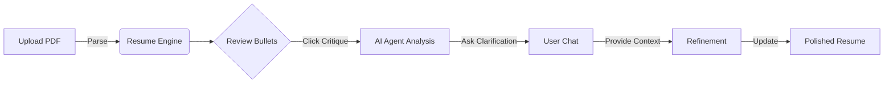

# Product Demo: Me Inc. Resume Coach

This walkthrough demonstrates the **Resume Coach** workflow, where we parse a PDF resume, critique it using AI, and refine it interactively.

## Workflow Overview

## Demo Recording

## Step-by-Step Guide

### 1. Upload & Parse
We start by uploading a PDF resume. The system uses **GPT-4o** to parse the unstructured text into a structured JSON schema, identifying sections like Experience, Education, and Skills.

### 2. Intelligent Critique
The **Guide Agent (DSPy)** analyzes each bullet point against the **STAR (Situation, Task, Action, Result)** methodology. It looks for:
- Weak action verbs
- Missing metrics (Results)
- Vague context (Situation)

### 3. Interactive Refinement
Instead of just rewriting, the agent asks **targeted questions**. 
*Example:* "You mentioned optimizing the database, but what was the impact on query time or cost?"

### 4. Real-time Updates
Once you provide the context, the agent rewrites the bullet point to be high-impact and automatically updates your resume preview.
